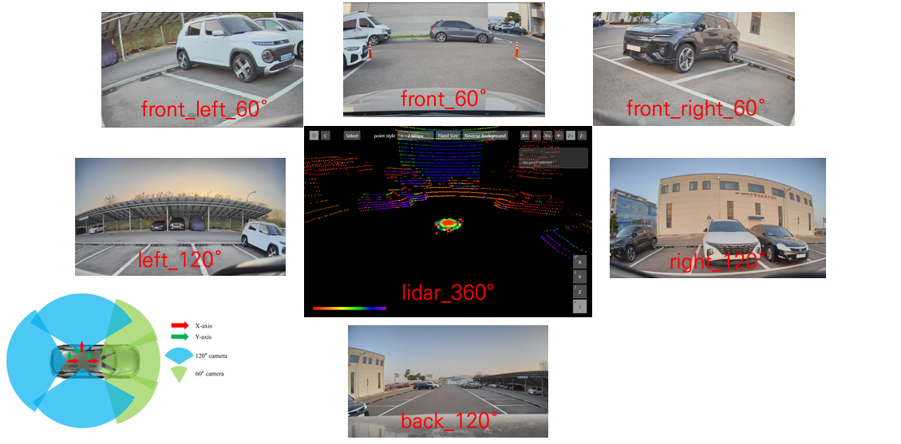
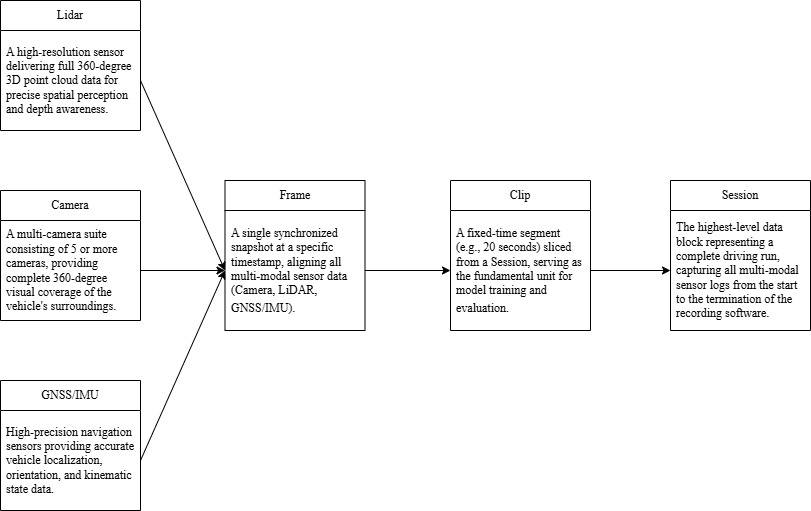

# KIAPI End-to-End Dataset

## KIAPI End-to-End Dataset for Autonomous Systems

 

The KIAPI End-to-End Dataset is a large-scale, multi-modal dataset specifically curated to advance the frontiers of End-to-End (E2E) Autonomous Driving and Physical AI. 

Additionally, it serves as the official foundational dataset for the “2026 A1 Autonomous Car Challenge”, a premier E2E autonomous driving competition. (https://autonomouscar.or.kr/)

Collected across diverse geographical regions and complex urban road environments, this dataset provides a comprehensive sensor suite designed to facilitate the direct mapping of raw sensor inputs to vehicle control and behavioral planning. Our primary goal is to empower the global research community by providing high-quality, real-world data tailored for pure E2E learning paradigms.

### Key Highlights
* **Comprehensive Sensor Suite:** Includes 360-degree multi-camera coverage, high-resolution 360-degree LiDAR point clouds, and synchronized GNSS/IMU telemetry.
* **Future-Ready Scalability:** The current sensor configuration is designed with extensibility in mind, with plans to integrate additional sensor modalities in future releases. Furthermore, the inclusion of perception-level labeling data is currently under consideration to support diverse auxiliary research tasks in the future.
* **Versatile Applications:** While strictly optimized for E2E control and Physical AI systems, the dataset's rich raw sensor logs and structural flexibility allow it to be utilized for various foundational research efforts in autonomous systems.
* **Open Research Initiative:** Developed and released to accelerate innovation in the field. We encourage researchers to explore, benchmark, and build upon this data to drive the industry forward.

> **Note on Sample Release:** > The current distribution consists of Sample Data intended for format familiarization and initial testing. A more refined and comprehensive Official Dataset is scheduled for release in the near future.

---

### Version History

| Version | Notes |
| :--- | :--- |
| **v0.1** | Sample data for test |

---

## Intended Usage

* **End-to-End Autonomous Driving (Primary Focus):** Developing, training, and benchmarking models that map raw multi-modal sensor inputs directly to future vehicle trajectories. Instead of low-level control commands, the dataset provides high-fidelity recorded trajectory logs to serve as ground truth for motion planning.
* **Physical AI & Embodied Intelligence:** Advancing the broader field of Physical AI. The comprehensive 360-degree spatial and temporal data can be leveraged to train generalized foundation models that understand, navigate, and interact with complex physical environments, offering high transferability to mobile robotics and autonomous machinery.
* **Multi-Sensor Fusion & Alignment:** Utilizing the rigorously synchronized multi-camera, 360-degree LiDAR, and GNSS/IMU data for advanced research in sensor calibration, spatial-temporal alignment, and robust state estimation in dynamic urban scenes.
* **Open-Ended Foundational Research:** Beyond specific driving tasks, researchers are encouraged to utilize the raw, unadulterated sensor logs for exploratory studies in multi-modal scene representation, predictive modeling, and spatial awareness.

---

## Data Format

The KIAPI End-to-End Dataset employs a highly structured, relational database approach (PostgreSQL) to manage extensive metadata, seamlessly linked with external storage for raw multi-modal sensor files. This architecture is designed to handle large-scale time-series data efficiently for E2E trajectory planning.

### 1. Data Hierarchy
To facilitate streamlined training and evaluation, the continuous driving data is hierarchically segmented:

* **Session:** Represents a continuous, unbroken recording of a driving run, linking the specific vehicle, driver, and scenario.
  
  | Column Name | Description |
  | :--- | :--- |
  | `session_index` | [cite_start]Unique index of the session. [cite: 14] |
  | `scenario_index` | [cite_start]Index of the scenario where the session was recorded. [cite: 14] |
  | `vehicle_index` | [cite_start]Index of the vehicle used to record the session. [cite: 14] |
  | `driver_index` | [cite_start]Index of the driver who recorded the session. [cite: 14] |
  | `session_start_timestamp` | [cite_start]Timestamp when the session recording started. [cite: 14] |
  | `session_finish_timestamp` | [cite_start]Timestamp when the session recording ended. [cite: 14] |
  | `head_clip_index` | [cite_start]Index of the first clip within the session. [cite: 14] |
  | `tail_clip_index` | [cite_start]Index of the last clip within the session. [cite: 14] |
  | `note` | [cite_start]Additional details about the session. [cite: 14] |

* **Clip:** The fundamental unit for training and evaluation. Sessions are sliced into fixed time segments (e.g., 20 seconds). Each clip contains information regarding specific driving events and references the compressed raw sensor data files.
  
  | Column Name | Description |
  | :--- | :--- |
  | `clip_index` | [cite_start]Unique index of the clip. [cite: 17] |
  | `session_index` | [cite_start]Index of the session to which this clip belongs. [cite: 17] |
  | `event` | [cite_start]Indicates the presence of a specific driving event within the clip. [cite: 17] |
  | `clip_start_timestamp` | [cite_start]Start timestamp of the clip. [cite: 17] |
  | `clip_finish_timestamp` | [cite_start]End timestamp of the clip. [cite: 17] |
  | `tail_frame_index` | [cite_start]Index of the last frame within this clip. [cite: 17] |
  | `lidar_compressed_filename` | [cite_start]Path and filename of the compressed LiDAR data (e.g., `clip_index_LIDAR_TOP.zip`). [cite: 17] |
  | `camera_compressed_filename` | [cite_start]Path and filename of the compressed Camera data (e.g., `clip_index_CAMERA_FRONT.zip`). [cite: 17] |
  | `radar_compressed_filename` | [cite_start]Path and filename of the compressed Radar data. [cite: 17] |

* **Frame:** The granular reference point within a clip. Rather than relying on exact hardware-level synchronization, a frame is constructed based on a baseline timestamp. It aligns the disparate multi-modal sensor data (LiDAR, Camera, Radar) by strictly grouping the most recent data points acquired prior to this baseline, ensuring no future information is referenced.
  
  | Column Name | Description |
  | :--- | :--- |
  | `frame_index` | [cite_start]Unique internal index for the frame. [cite: 20] |
  | `clip_index` | [cite_start]Index of the clip to which this frame belongs. [cite: 20] |
  | `current_index` | [cite_start]The sequential index of the frame within its specific clip. [cite: 20] |
  | `time_offset` | [cite_start]Delta time from the starting frame of the clip to this current frame. [cite: 20] |

### 2. Ego State & Trajectory Ground Truth (`ego_pos`)
* For E2E motion planning, the `ego_pos` table serves as the primary ground truth. Derived from high-precision GNSS/IMU sensors, it provides comprehensive vehicle kinematics.
* **Trajectory Tracking:** Includes relative coordinates (`rel_x`, `rel_y`, `rel_z`) measured from the starting position of each clip, enabling precise local trajectory generation.
* **Kinematics & Dynamics:** Provides 3D velocities (`vx`, `vy`, `vz`), accelerations (`ax`, `ay`, `az`), quaternion-based orientation, and path curvature (`curvature`).

### 3. Sensor Data Management
To optimize storage and access, the dataset separates raw sensor files from their metadata:
* **Raw Data:** The actual high-resolution images and point clouds are stored externally. The paths to these compressed files (e.g., `clip_index_CAMERA_FRONT.zip`, `clip_index_LIDAR_TOP.zip`) are cataloged at the Clip level.
* **Sensor Metadata:** The `camera`, `lidar` tables store frame-level metadata, including exact acquisition timestamps, channel information, and an is_key_frame flag. This flag indicates which specific sensor data point was selected as the closest preceding match to the frame's baseline timestamp.

### 4. Contextual Metadata
Understanding the environment and setup is crucial for Physical AI generalization. The dataset provides rich context through auxiliary tables:
* **Vehicle:** Contains detailed sensor configurations, including extrinsic calibration parameters (TF) and intrinsic specs, stored in a flexible JSON format (`sensor_config`).
* **Driver:** Includes behavioral context, such as driving style (e.g., Aggressive, Normal, Defensive) and years of experience.
* **Scenario:** Categorizes the environmental context, including city names, road names, and road types (e.g., Highway, City road).

---

## Developer Toolkit

*(To Be Updated)*
* **Python API Toolkit & pip package:** Tools for easily querying the database and loading synchronized sensor data.
* **Quick Start Examples:** Simple code snippets demonstrating how to integrate the dataset into a PyTorch DataLoader.

---

## License & Acknowledgement

### License
The copyright and ownership of this dataset belong to the **Korea Intelligent Automotive Parts Promotion Institute (KIAPI)**.
*(Note: Specific open-source license terms such as Apache 2.0 or BSD will be updated shortly.)*

### Acknowledgement
This dataset was developed as part of a **National Research Project** funded by the South Korean government. Any publications, research, or projects utilizing this dataset must explicitly include the appropriate citation and acknowledgment of KIAPI's contribution.

### Contact
For usage inquiries, data access, or technical support, please contact the project coordinators:
* **HyeongSeok Yun** (Team Manager/Strategic Planning Division) - `[gudtjr0124@kiapi.or.kr]`
* **Hyun Woo** (Associate Researcher/Strategic Planning Division) - `[hyunwoo@kiapi.or.kr]`